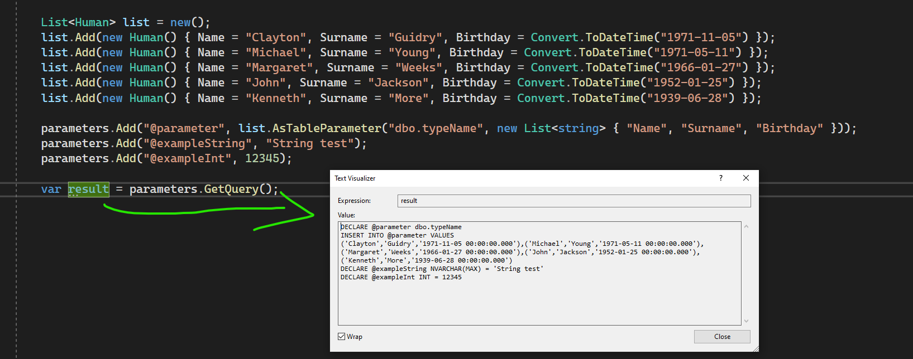
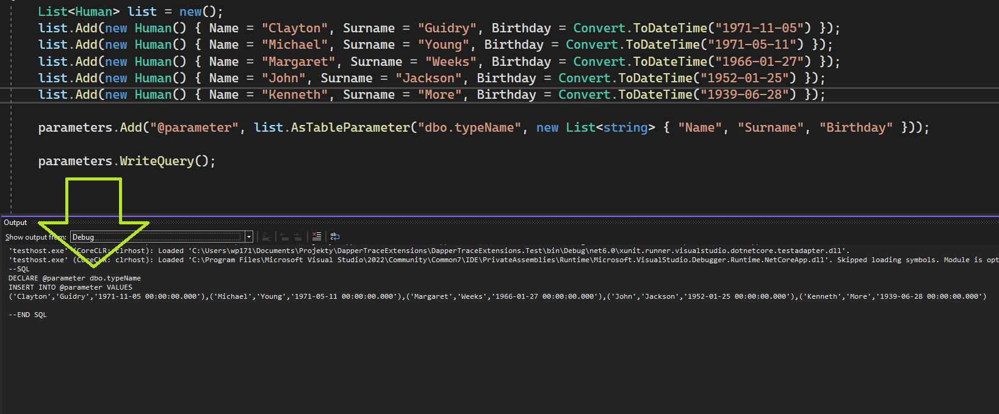

# DapperTraceExtensions
Library adds extension methods to DynamicParameters class:

##GetQuery
generate query based on parameters and return string 

##WriteQuery 
generate query based on parameters and write it to Debug window
